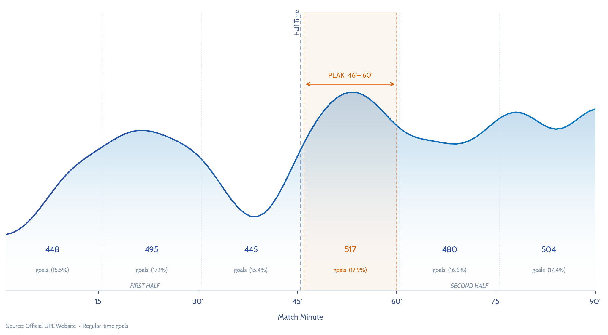
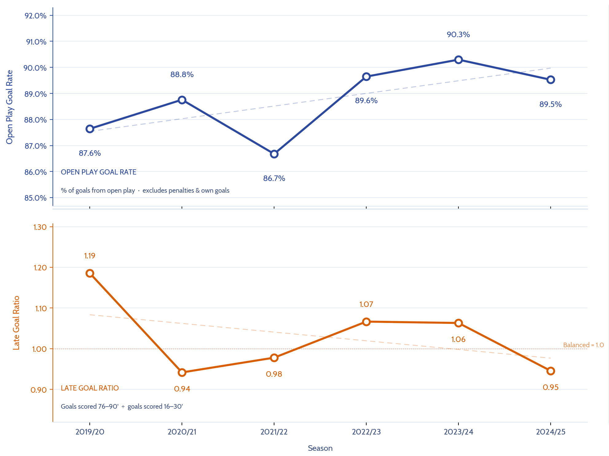

# UPL Match Intelligence

An open-source Uganda Premier League data platform for collecting, modeling,
analyzing, and presenting official UPL match data.

This project began as a focused goal timing analysis. It is now evolving into a
full-stack football intelligence system: Python scraping and cleaning, Postgres
storage, FastAPI access, React presentation, notebook-based research, and
scheduled updates.

## What This Project Is Becoming

The official UPL website is the source archive. UPL Match Intelligence is the
analysis layer on top of it.

The long-term goal is to answer questions that are difficult to answer from
individual match pages:

- Which teams are most dangerous after halftime?
- Which clubs concede late most often?
- Which teams are most disciplined or most card-prone?
- How do cards affect match outcomes?
- Which players are regular starters or impact substitutes?
- Which officials produce high-card matches?
- How do team profiles change across seasons?
- Which matches had the most dramatic timelines?

## Feature 1: Goal Timing Pilot

The first completed analysis in this project is the original UPL goal timing
study. It remains the pilot feature for the wider platform.

The pilot covered six completed seasons from 2019/20 through 2024/25 and found
that the most dangerous regular-time period in UPL matches was not the final 15
minutes, but the first 15 minutes after halftime.

Across 3,222 regular-time goals, the 46-60 minute interval accounted for 17.9%
of goals. At finer resolution, the 51-60 minute window was the highest-volume
10-minute block, and the 56-60 minute window was the highest-volume five-minute
block.



### Pilot Finding: Goal Distribution By Interval

| Interval | Goals | Share | Note |
|----------|-------|-------|------|
| 0-15' | 413 | 14.5% | Settling phase |
| 16-30' | 488 | 17.1% | Organised, settled play |
| 31-45' | 441 | 15.4% | Late first half |
| **46-60'** | **517** | **17.9%** | **Peak: second-half restart** |
| 61-75' | 480 | 16.6% | Mid second half |
| 76-90' | 504 | 17.4% | Final phase |

Regular-time goals only. Added-time goals are separated from interval analysis.



### Pilot Research Questions

The pilot analysis answered:

1. When in a match are goals most likely to be scored in Ugandan top-flight
   football?
2. Has the proportion of open-play goals changed across seasons?
3. Are decisive late goals becoming more or less common relative to the rest of
   the match?

The next phase is to keep this analysis as Feature 1 and promote its most useful
findings into the future API and React dashboard.

## Platform Architecture

Target flow:

```text
official UPL website
  -> Python scraper
  -> raw files/cache
  -> cleaning and validation
  -> Postgres
  -> FastAPI
  -> React web app
```

The project is organized into three tracks.

### 1. Data Platform

Responsible for scraping, cleaning, loading, validating, and updating data.

Current scraper output includes:

- `matches`
- `events`
- `lineups`
- `staff`
- `officials`
- `stats`
- `failed_matches`

### 2. Research Lab

Responsible for exploratory analysis in notebooks.

Notebook work is where new questions are tested before becoming production
features. The goal timing study is Feature 1. Future features may include
discipline analysis, home advantage, comeback analysis, player impact, official
profiles, and team style summaries.

### 3. Public Product

Responsible for the user-facing API and dashboard.

The future React app should consume FastAPI endpoints backed by Postgres. It
should not read CSV files directly.

## Repository Structure

```text
upl-goal-timing/
├── README.md
├── AGENTS.md
├── requirements.txt
├── api/
│   └── routers/
├── database/
│   ├── migrations/
│   └── seeds/
├── docs/
│   └── PROJECT_ROADMAP.md
├── frontend/
├── notebooks/
│   └── features/
│       └── feature_01_goal_timing/
│           ├── analysis.ipynb
│           └── analysis_v2.ipynb
├── outputs/
│   └── features/
│       └── feature_01_goal_timing/
│           ├── goal_timing_upl.png
│           ├── gqr_gtsi_trends.png
│           └── gqr_gtsi_trends_notebook.png
├── scripts/
│   ├── data_platform/
│   │   └── scrape_upl_matches.py
│   └── features/
│       └── feature_01_goal_timing/
│           └── build_goal_timing_dataset.py
└── src/
    ├── analytics/
    ├── db/
    ├── features/
    │   └── feature_01_goal_timing/
    ├── scraping/
    ├── validation/
    ├── cleaning.py
    ├── config.py
    └── dataset.py
```

Some folders are intentionally empty for now. They reserve the approved
architecture for future implementation.

## Current Commands

Install dependencies:

```bash
pip install -r requirements.txt
```

Scrape a season:

```bash
python scripts/data_platform/scrape_upl_matches.py --season 2025-26
```

Build the Feature 1 goal timing dataset:

```bash
python scripts/features/feature_01_goal_timing/build_goal_timing_dataset.py
```

Open the Feature 1 research notebooks:

```text
notebooks/features/feature_01_goal_timing/
```

## Roadmap

The detailed implementation plan lives in
[docs/PROJECT_ROADMAP.md](docs/PROJECT_ROADMAP.md).

Near-term phases:

1. Stabilize the structured scraper outputs.
2. Add Postgres schema and ingestion.
3. Add validation and analytics models.
4. Build a read-first FastAPI backend.
5. Build a React frontend with the goal timing pilot as Feature 1.
6. Add GitHub Actions for scheduled current-season updates.
7. Promote new notebook analyses into dashboard features.

## Data Note

Raw and processed data are not committed to this repository. The data is
collected from the official UPL website for analytical purposes. The scraper and
analysis pipeline are included so the methodology can be inspected and reused.

## References

Armatas, V., & Pollard, R. (2014). Home advantage in Greek football. *Journal of
Sports Sciences*, 32(12), 1210-1218.

Lago-Ballesteros, J., & Lago-Penas, C. (2010). Performance in team sports:
Identifying the keys to success in soccer. *Journal of Human Kinetics*, 25,
85-91.

Njororai, W. W. S. (2013). Analysis of goals scored in the 2010 World Cup soccer
tournament held in South Africa. *Journal of Physical Education and Sport*,
13(1), 6-13.

Yiannakos, A., & Armatas, V. (2006). Evaluation of the goal scoring patterns in
European Championship in Portugal 2004. *International Journal of Performance
Analysis in Sport*, 6(1), 178-188.

---

**Humphrey Nyanzi**  
Sports Scientist & Data Analyst  
[GitHub](https://github.com/humphrey-nyanzi) ·
[Substack](https://humphreyn-substack.com) · [X](https://x.com/phreyn)
