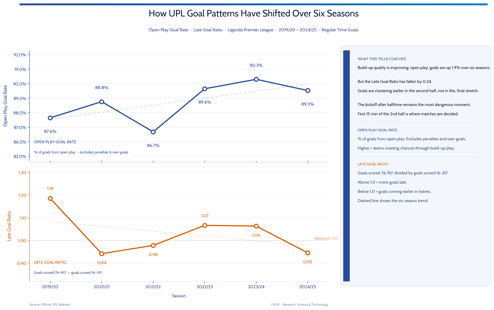

# Uganda Premier League Goal Timing Analysis

Six seasons. 3,222 goals. One finding that contradicts what most football research says about when matches are decided.

---

## What This Project Is

This is a longitudinal analysis of goal-scoring patterns in the Uganda Premier League covering every available match from 2019/20 through 2024/25. The data was collected from the official UPL website, cleaned through a documented pipeline, and analysed to answer three questions:

1. When in a match are goals most likely to be scored in Ugandan top-flight football?
2. Has the proportion of goals created through open play changed over six seasons?
3. Are decisive late goals becoming more or less common relative to the rest of the match?

The project was built independently using publicly available data. All code is in this repository.

---

## The Main Finding

Every coaching manual points to the final 15 minutes as the danger zone. Research on European football backs this up: the 76–90 minute window is consistently the highest-scoring period in elite competition, driven by physical fatigue and tactical desperation in the closing stages.

The Uganda Premier League tells a different story.

Across six seasons and 3,222 goals, **the 15 minutes immediately after halftime (46–60') is the most dangerous period in a UPL match**, accounting for 17.9% of all regular-time goals. The late-game surge that dominates European research is present in the UPL, but it is secondary. The halftime restart, not the final whistle, is when teams are most exposed.

At finer resolution, the peak sharpens further. The 51–60 minute window is the highest-volume 10-minute block in the dataset. The 56–60 window is the highest-volume five-minute block. The concentration is not spread evenly across the second half. It sits in the second half of the first ten minutes after the restart.


---

## Goal Distribution by Interval

| Interval | Goals | Share | Note |
|----------|-------|-------|------|
| 0–15' | 413 | 14.5% | Settling phase |
| 16–30' | 488 | 17.1% | Organised, settled play |
| 31–45' | 441 | 15.4% | Late first half |
| **46–60'** | **517** | **17.9%** | **Peak — second-half restart** |
| 61–75' | 480 | 16.6% | Mid second half |
| 76–90' | 504 | 17.4% | Final phase |

*Regular-time goals only. Added-time goals excluded from interval analysis.*

---

## How the League Has Changed Over Six Seasons

Beyond the static distribution, this project tracks two measures of how the UPL's goal-scoring character has evolved season by season.

### Open Play Goal Rate

The percentage of goals that come from genuine attacking play, excluding penalties and own goals. A penalty is a referee decision. An own goal is a defensive error. Neither tells you much about the quality of attacking build-up. Tracking only open-play goals gives a cleaner read on whether teams are creating better chances through competitive sequences.

The rate has risen from 87.6% in 2019/20 to 89.5% in 2024/25, with 2023/24 recording the six-season high at 90.3%. Five of six seasons sit above the opening benchmark. Roughly 1 in 8 goals came from penalties or own goals in 2019/20. By 2023/24 that had fallen to fewer than 1 in 10.

### Late Goal Ratio

A comparison of how many goals are scored in the decisive final phase of a match (76–90') against how many are scored in the settled mid-first-half phase (16–30'). A value above 1.0 means more goals in the late decisive window than in the organised baseline. Below 1.0 means the opposite.

The 16–30 window is used as the reference because it represents the most predictable, organised phase of a match: past the opening scramble, not yet near the break.



| Season | Goals | Open Play Rate | Late Goal Ratio |
|--------|-------|----------------|-----------------|
| 2019/20 | 437 | 87.6% | 1.19 |
| 2020/21 | 596 | 88.8% | 0.94 |
| 2021/22 | 563 | 86.7% | 0.98 |
| 2022/23 | 425 | 89.7% | 1.07 |
| 2023/24 | 505 | 90.3% | 1.06 |
| 2024/25 | 506 | 89.5% | 0.95 |

The Late Goal Ratio fluctuates around 1.0 with no clear directional trend. Four of six seasons sit at or above 1.0. The practical read: UPL matches stay live to the end. A lead held at 70 minutes is not a safe lead.

---

## Why the UPL Pattern Might Differ from European Research

This analysis documents the pattern. It does not have sufficient data to confirm the cause. Three explanations are worth investigating:

**Halftime tactical disruption.** If UPL teams struggle to implement defensive changes effectively during the interval, the opening minutes of the second half become structurally exposed before organisation is restored. This would explain why the peak sits specifically in the 50–60 window rather than being distributed evenly across the second half.

**Physical environment.** Heat, humidity, and pitch conditions in Uganda may accelerate when physical stress becomes acute in a match, shifting the fatigue-driven vulnerability window earlier than what European research documents.

**Coaching adjustment quality.** If opposing teams are systematically more effective at acting on halftime insights than the defending team is at implementing them, the 46–60 window becomes habitually exploitable.

Resolving which of these drives the pattern requires GPS load data, real-time match state records, or controlled cross-league comparisons. The data in this project establishes that the pattern is real and consistent. The cause is the next research question.

---

## Dataset

- **Source:** Official Uganda Premier League website (upl.co.ug)
- **Seasons:** 2019/20 through 2024/25 (six complete seasons)
- **Collection:** Automated web scraping via Python (BeautifulSoup + requests)
- **Coverage:** 16 clubs per season; 15 in 2022/23 following Kyetume FC's license withdrawal
- **Missing data:** 6.9% of matches had incomplete goal records and were excluded
- **Exclusion:** Added-time goals separated from regular-time goals for all interval analyses
- **Cleaned dataset:** 3,222 regular-time goals across 2,846 goal records after validation

---

## Repository Structure

```
upl-goal-timing/
├── README.md
├── requirements.txt
├── src/
│   ├── config.py             ← paths, constants, team name mappings
│   ├── dataset.py            ← data loading and consolidation
│   └── cleaning.py           ← full cleaning pipeline
├── scripts/
│   ├── 01_scraping.py        ← scrape by season
│   ├── 02_cleaning.py        ← run cleaning pipeline
│   └── 03_analysis.py        ← generate visualisations
└── outputs/
    ├── goal_timing_upl.png
    └── gqr_gtsi_trends.png
```

---

## Data Note

Raw data is not committed to this repository. The source is the official UPL website and the data was collected for analytical purposes. The full scraping pipeline is in `scripts/01_scraping.py` — anyone applying this methodology to another league or season can adapt it directly. Pre-processed data is available on request.

---

## References

Armatas, V., & Pollard, R. (2014). Home advantage in Greek football. *Journal of Sports Sciences*, 32(12), 1210–1218.

Lago-Ballesteros, J., & Lago-Peñas, C. (2010). Performance in team sports: Identifying the keys to success in soccer. *Journal of Human Kinetics*, 25, 85–91.

Njororai, W. W. S. (2013). Analysis of goals scored in the 2010 World Cup soccer tournament held in South Africa. *Journal of Physical Education and Sport*, 13(1), 6–13.

Yiannakos, A., & Armatas, V. (2006). Evaluation of the goal scoring patterns in European Championship in Portugal 2004. *International Journal of Performance Analysis in Sport*, 6(1), 178–188.

---

**Humphrey Nyanzi**  
Sports Scientist & Data Analyst   
[GitHub](https://github.com/your-username) · [Substack](https://your-substack.com) · [X](https://x.com/your-handle)