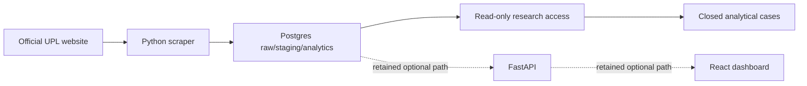

# UPL Lens

An open-source Uganda Premier League analytical data foundation and practical
casework system.

UPL Lens maintains source acquisition, Postgres data contracts, validation,
reproducible read-only research access, and bounded football investigations
grounded in official Uganda Premier League source records. The former public
software-product phase proved the full path from official source pages through
scraping, Postgres, FastAPI, React, scheduled operations, QA, and public
presentation. That code and the lessons from that phase are retained, but the
public app is no longer the automatic destination for every successful
analysis.

The active project flow is:

```text
Official UPL website
  -> Python scraper
  -> maintained Postgres raw/staging/analytics contracts
  -> read-only research access
  -> practical analytical cases with reproducibility records
```

The goal is not to mirror the official UPL website. The official site is the
source archive; this project is the analytical foundation and casework layer on
top of it.

The current project identity is documented in
[docs/PRODUCT_STRATEGY.md](docs/PRODUCT_STRATEGY.md). The former public-product
strategy is preserved there as historical context and as retained design
knowledge for any future owner-approved presentation work.

## Retained Hosted Surfaces

Under #108, owner disposition is under reconsideration. The public Cloudflare
sites, Cloudflare API proxy, and unrestricted Render FastAPI exposure remain
live for now. A dormant/archive demonstration option is being evaluated because
the hosted surfaces currently cost nothing. No retirement or archive provider
change has been completed or authorized, and no static public archive is
currently authorized or completed.

The reconsideration preserves source code, tests, Git history, Supabase,
ingestion, and read-only research access.

Historical/retained URLs from the public-product phase:

- Frontend: [UPL Lens](https://upl-lens.pages.dev/)
- App API proxy: [UPL Lens API via Cloudflare](https://upl-lens.pages.dev/api/health)
- Backend API origin: [UPL Lens API on Render](https://upl-match-intelligence-api.onrender.com/)
- API liveness check:
  [`/health/live`](https://upl-match-intelligence-api.onrender.com/health/live)
- API/database health check:
  [`/health`](https://upl-match-intelligence-api.onrender.com/health)

## Retained Public App And API

The hosted frontend and API are retained legacy assets from the completed
software-product phase. They may remain useful for demonstration, review, or a
future explicitly approved presentation surface, but they are not the default
destination for new casework.

The backend supports routine intelligence modules for the retained public
frontend, so the app can show football meaning instead of only archive records.

These endpoints support season trend charts, attack/defence comparison, team
profile signals, match interest scoring, key moments, player contribution
leaderboards, and visible data-quality caveats:

- `GET /trends/seasons`
- `GET /teams/{team_slug}/profile`
- `GET /matches/intelligence`
- `GET /players/leaderboards`
- `GET /teams`
- `GET /matches/{match_id}`
- `GET /players/{player_slug}`
- `GET /overview/intelligence`
- `GET /seasons/overview`

For the current frontend-facing contract, see
[docs/FRONTEND_DESIGN_SYSTEM.md](docs/FRONTEND_DESIGN_SYSTEM.md).

## What It Investigates

UPL Lens is now used to answer bounded football questions that are difficult to
answer from individual match pages:

- Which teams score or concede most in different match periods?
- Which clubs are most disciplined or card-prone?
- How do cards, lineups, officials, and match events shape outcomes?
- Which teams, players, and matches stand out across seasons?

New UPL work should end as a closed analytical case: question, source snapshot
or coverage record, checks, notebook, findings or report, outputs, caveats, and
a hard endpoint. Goal Timing is the historical first analysis and retained
product example, not a standing promise that every case becomes a dashboard.

## Current System

The repository currently contains:

- Source acquisition and current-season refresh scripts.
- Supabase Postgres database contracts with `raw`, `staging`, `analytics`, and
  `app_meta` schemas.
- Validation, operation summaries, run artifacts, and fail-closed refresh
  behavior.
- Read-only research access patterns for notebooks and analytical cases.
- Retained FastAPI and React code from the public-product phase.
- GitHub Issues, branches, draft PRs, and owner review as the work-management
  model.

## Technical Highlights

For portfolio and recruiting review, this repository demonstrates:

- **Data engineering**: official-source scraping, raw persistence, idempotent
  loading, and current-season refresh orchestration.
- **Database modeling**: Postgres schemas for raw source data, cleaned staging
  tables, analytics-ready objects, migrations, and least-privilege roles.
- **Validation and operations**: row-count verification, staging validation
  issues, run summaries, logs, artifacts, and escalation rules.
- **Backend development**: retained read-first FastAPI routes backed by a
  query/service layer under `src/api/`.
- **Frontend development**: retained React product routes for overview, trends,
  matches, teams, players, insights, goal timing, methodology, loading states,
  and API status.
- **Research workflow**: notebooks, case records, research briefs, caveats, and
  reproducible evidence for bounded UPL questions.
- **Deployment**: Cloudflare Pages, Render, Supabase, GitHub Actions, CORS, and
  environment-based configuration.

## Architecture


```mermaid
flowchart LR
    A["Official UPL website"] --> B["Python scraper"]
    B --> C["Postgres raw/staging/analytics"]
    C --> D["Read-only research access"]
    D --> E["Closed analytical cases"]
    C -. "retained optional path" .-> F["FastAPI"]
    F -. "retained optional path" .-> G["React dashboard"]
```

The retained browser-facing contract is:

```text
React UI -> FastAPI endpoint -> Postgres query/view -> JSON -> chart/table
```

The frontend must not read raw CSV files, notebooks, or exported notebook
images. For new UPL work, the default deliverable is a reproducible case record
over maintained Postgres data. Software promotion is exceptional and
decision-gated.

Main repository areas:

```text
api/          FastAPI app and routers
database/     SQL migrations, seeds, and permission templates
docs/         roadmap, operations, feature workflow, deployment, and doc map
frontend/     React dashboard
notebooks/    research feature packages
scripts/      scraping, loading, staging, and automation scripts
src/          shared Python modules for scraping, db, API, research, validation
tests/        early pytest coverage for risky logic
```

## Run Locally

For full setup, use [docs/LOCAL_DEVELOPMENT.md](docs/LOCAL_DEVELOPMENT.md).
After configuring `.env` and a local Postgres database, the short version is:

```powershell
# Python dependencies
pip install -r requirements.txt

# Apply database migrations and build trusted tables
python scripts/data_platform/apply_db_migrations.py
python scripts/data_platform/load_raw_to_postgres.py --season 2025-26 --full-rebuild
python scripts/data_platform/build_staging_from_raw.py
python scripts/data_platform/verify_staging_outputs.py

# Run the API
python -m uvicorn api.main:app --reload

# Run the frontend
cd frontend
npm install
npm run dev
```

On this Windows development setup, `.venv\Scripts\python.exe` is the preferred
Python executable once the virtual environment exists.

Run tests with:

```powershell
python -m pytest
```

## Documentation

Use these docs instead of trying to learn the whole repository from the README:

| Need | Start here |
|------|------------|
| First orientation | [docs/START_HERE.md](docs/START_HERE.md) |
| Project identity, retained product lessons, and decision rules | [docs/PRODUCT_STRATEGY.md](docs/PRODUCT_STRATEGY.md) |
| Local setup, common commands, and operations | [docs/LOCAL_DEVELOPMENT.md](docs/LOCAL_DEVELOPMENT.md) |
| Visual codebase overview | [docs/diagram_collection.md](docs/diagram_collection.md) |
| Which doc to open | [docs/START_HERE.md](docs/START_HERE.md) |
| Roadmap and current priorities | [docs/PROJECT_ROADMAP.md](docs/PROJECT_ROADMAP.md) |
| Research/case workflow and exceptional promotion rules | [docs/FEATURE_PROMOTION_WORKFLOW.md](docs/FEATURE_PROMOTION_WORKFLOW.md) |
| Retained frontend/API contract and design rules | [docs/FRONTEND_DESIGN_SYSTEM.md](docs/FRONTEND_DESIGN_SYSTEM.md) |

## Data Note

Raw and processed data files are not committed to this repository. The scraper
and pipeline are included so the methodology can be inspected and rerun against
the official UPL website for analytical purposes.

## Author

**Humphrey Nyanzi**  
Sports Scientist & Data Analyst  
[GitHub](https://github.com/humphrey-nyanzi) ·
[Substack](https://humphreyn-substack.com) · [X](https://x.com/phreyn)
