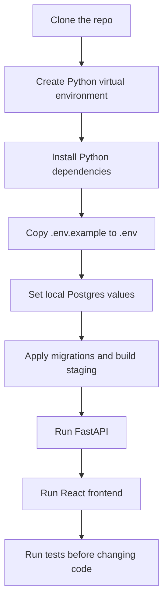
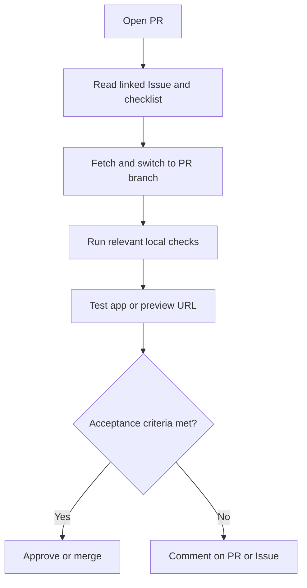

# Local Development And Operations

This guide is the practical path for running, checking, refreshing, validating,
and debugging the UPL Lens repo.

Use [START_HERE.md](START_HERE.md) for project orientation and current
high-signal history before digging deeper.

## First 30 Minutes

This is the shortest useful path for a new developer.



Recommended PowerShell flow:

```powershell
py -m venv .venv
.venv\Scripts\python.exe -m pip install -r requirements.txt
Copy-Item .env.example .env
Copy-Item frontend\.env.example frontend\.env
```

Then edit `.env` with local Postgres values:

```text
POSTGRES_HOST
POSTGRES_PORT
POSTGRES_DB
POSTGRES_USER
POSTGRES_PASSWORD
POSTGRES_SSLMODE
ALLOWED_ORIGINS
```

For local frontend development, `frontend/.env` should normally contain:

```text
VITE_API_BASE_URL=http://127.0.0.1:8000
```

## Common Commands

Use `.venv\Scripts\python.exe` when the local virtual environment exists.

| Task | Command |
|------|---------|
| Install Python dependencies | `.venv\Scripts\python.exe -m pip install -r requirements.txt` |
| Install API-only dependencies | `.venv\Scripts\python.exe -m pip install -r requirements-api.txt` |
| Install automation dependencies | `.venv\Scripts\python.exe -m pip install -r requirements-automation.txt` |
| Apply database migrations | `.venv\Scripts\python.exe scripts\data_platform\apply_db_migrations.py` |
| Full raw-season rebuild (admin/backfill) | `.venv\Scripts\python.exe scripts\data_platform\load_raw_to_postgres.py --season 2025-26 --full-rebuild` |
| Verify raw Postgres counts | `.venv\Scripts\python.exe scripts\data_platform\verify_raw_postgres_counts.py` |
| Build staging tables | `.venv\Scripts\python.exe scripts\data_platform\build_staging_from_raw.py` |
| Verify staging outputs | `.venv\Scripts\python.exe scripts\data_platform\verify_staging_outputs.py` |
| Refresh current season safely | `.venv\Scripts\python.exe scripts\data_platform\update_hosted_data.py --season-scope current --run-type routine-refresh` |
| Run Python tests | `.venv\Scripts\python.exe -m pytest` |
| Run FastAPI locally | `.venv\Scripts\python.exe -m uvicorn api.main:app --reload` |
| Install frontend dependencies | `cd frontend` then `npm install` |
| Run frontend dev server | `cd frontend` then `npm run dev` |
| Build frontend | `cd frontend` then `npm run build` |
| Preview frontend build | `cd frontend` then `npm run preview` |

## Local App Flow

Run the backend first:

```powershell
.venv\Scripts\python.exe -m uvicorn api.main:app --reload
```

Then open:

```text
http://127.0.0.1:8000/docs
```

In a second terminal, run the frontend:

```powershell
cd frontend
npm install
npm run dev
```

Then open:

```text
http://127.0.0.1:5173
```

The frontend should call the backend at:

```text
http://127.0.0.1:8000
```

## What Can Run Without Postgres?

Some checks do not need a live database:

- many unit tests around parsing and orchestration helpers
- `npm run build`
- frontend static type/build checks
- documentation edits and link checks

These usually need Postgres settings and reachable tables:

- `GET /health`
- most API endpoints
- raw count verification
- staging rebuilds
- staging output verification
- current-season refresh in full mode

If a command fails because Postgres is not configured, first check `.env` and
then check whether your local database exists.

## What To Run After Each Change

Use this table to avoid guessing.

| Change type | Minimum useful verification |
|-------------|-----------------------------|
| Documentation only | Read the changed doc and run a markdown-link check if links changed. |
| Python parsing or helper logic | `.venv\Scripts\python.exe -m pytest` |
| Scraper or raw-loading behavior | Relevant pytest tests, then `verify_raw_postgres_counts.py` if data changed. |
| Staging or validation logic | Relevant pytest tests, then `build_staging_from_raw.py` and `verify_staging_outputs.py`. |
| Current-season automation | Relevant pytest tests, then `update_hosted_data.py --season-scope current --run-type routine-refresh` for routine mode. |
| FastAPI route or schema | `.venv\Scripts\python.exe -m pytest`, run `uvicorn`, then check `/docs` and the affected endpoint. |
| React frontend | `cd frontend`, then `npm run build`; run the dev server for visual checks. |
| API response shape used by React | Verify the endpoint and run `npm run build`. |
| Deployment config | Check the local build command and the relevant deployment runbook before changing hosted settings. |

### Verify the scoreline and timeline goal contracts

For the retained 2025/26 data contract, verify these sources separately:

```text
Scorelines -> standings GF/GA/GD, general goals per match, team superlatives
Timelines  -> event-led goal counts and timing analysis
Goal Timing -> regular-time timeline subset after documented exclusions
```

After applying migrations and rebuilding analytics summaries, check:

- `/seasons/overview?season=2025_26`: `goal_count` and
  `scoreline_goal_count` agree; `timeline_goal_count` remains separate.
- `/trends/seasons`: `goals_per_match` uses scoreline goals and
  `timeline_goals_per_match` preserves the event-derived comparison.
- `/teams?season=2025_26`: GF, GA, GD, and rate-based superlatives agree with
  scorelines; Buhimba has 15 sporting points, a `-3` adjustment, 12 official
  points, and an explanatory note.
- `/insights/goal-timing?season=2025_26`: the regular-time subset is shown
  alongside scoreline goals, timeline goals, timeline status counts, and
  mismatch counts.

The disposable local verification snapshot reproduced on 18 August 2026 contains 240
matches, 505 scoreline goals, 496 timeline goals, 462 regular-time Goal Timing
goals, seven partial timelines, one administrative-result timeline, and four
scoreline/timeline goal-count mismatches.

The 462 Goal Timing total includes Geofrey Gagganga's 34th-minute SC Villa goal
in match `31655`. July 2026 hosted raw artifacts recorded its minute as `334`
and therefore produced the earlier 461 subset count. The owning reconciliation,
artifact links, and source limitation are documented in
`notebooks/features/feature_01_goal_timing/research_brief.md`.

Raw-to-staging normalization corrects only that provenance-keyed analytical
row and leaves `raw.events` unchanged. Migration 012 applies the same exact-key
repair to an already-hosted staging row and fails unless exactly one malformed
or already-corrected row exists. Re-running the SQL is safe; other minute-334
events remain unchanged.

For the Buhimba points adjustment, the official standings source captured on
16 July 2026 was `https://upl.co.ug/season/2025-26/`; Issue #104 preserves the
dated audit evidence because that URL later changed content. Migration 012
keeps the public note factual: 15 sporting points, a three-point deduction, and
12 official points.

## Testing A Pull Request Before Merge

Use this when you want to test work that is still in a PR before it reaches
`main`.



Local branch test flow:

```powershell
git fetch origin
git switch <branch-name>
```

Then run the smallest useful verification from the table above. For frontend
work, usually run:

```powershell
cd frontend
npm run build
npm run dev
```

For hosted frontend PRs, also check the Cloudflare Pages preview deployment when
available. Record the preview URL, browser notes, and any extension-related
findings in the PR so the review history explains what was tested.

After a PR is merged, delete the short-lived branch unless it is an intentional
experiment. Do not keep fixed branches such as `frontend-work` or `agent-work`
for normal development; they make it harder to tell what has been reviewed.

## Local Troubleshooting

### Python command cannot import project modules

Run commands from the repository root:

```text
C:\Code\upl-lens
```

Prefer:

```powershell
.venv\Scripts\python.exe -m pytest
```

instead of relying on whichever `python` happens to be first on `PATH`.

### `ModuleNotFoundError: No module named 'fastapi'`

The virtual environment probably does not have the API dependencies installed.
Run:

```powershell
.venv\Scripts\python.exe -m pip install -r requirements.txt
```

### Postgres connection fails

Check these first:

- `.env` exists.
- `.env` has the correct `POSTGRES_*` values.
- the database named by `POSTGRES_DB` exists.
- `POSTGRES_SSLMODE` is appropriate for local or hosted Postgres.
- the database user has permission to read the schemas used by the command.

For hosted Supabase pooler connections, usernames may need the project-reference
suffix, such as:

```text
upl_actions_loader.<project-ref>
```

The role inside Postgres is still normally just:

```text
upl_actions_loader
```

### FastAPI starts but the frontend says the API is offline

Check:

- FastAPI is running at `http://127.0.0.1:8000`.
- `frontend/.env` has `VITE_API_BASE_URL=http://127.0.0.1:8000`.
- `ALLOWED_ORIGINS` in `.env` includes `http://127.0.0.1:5173`.
- after changing `frontend/.env`, restart `npm run dev`.

For historical hosted deployments, privacy extensions such as Ghostery could
block direct browser calls from `upl-lens.pages.dev` to the `onrender.com` API
domain and surface as `net::ERR_BLOCKED_BY_CLIENT` or a blocked `/health`
request. The retained Cloudflare Pages proxy avoided that while the public app
was active.

### Hosted URLs

Issue #108 keeps the public Cloudflare sites, Cloudflare API proxy, and
unrestricted Render FastAPI exposure live as dormant retained demonstrations.
They have no active-product support or uptime promise. Do not delete, suspend,
convert, broaden, or otherwise change these providers without a new explicit
owner approval.

- Shared frontend URL: `https://upl-lens.pages.dev/`
- Legacy frontend fallback: `https://upl-match-intelligence.pages.dev/`
- Browser-facing API proxy: `https://upl-lens.pages.dev/api/`
- Backend origin API: `https://upl-match-intelligence-api.onrender.com/`

The active Supabase/Postgres foundation, ingestion, validation, and read-only
research access remain operationally independent of this dormant browser path.

### Hosted frontend API proxy

Historical production Cloudflare Pages builds used:

```text
VITE_API_BASE_URL=/api
```

The retained `frontend/functions/api/[[path]].js` Cloudflare Pages Function proxies `/api/*` to the Render API while the historical hosted path exists:

```text
https://upl-lens.pages.dev/api/health -> https://upl-match-intelligence-api.onrender.com/health
```

This keeps browser requests same-origin, for example
`https://upl-lens.pages.dev/api/health`, while the Pages Function forwards the request to
Render server-side. This avoids false backend-offline states caused by privacy
extensions blocking third-party `onrender.com` fetches from the public app. Keep
local development on `http://127.0.0.1:8000` so Vite talks directly to the local
FastAPI server.

The Pages Function also caches public, unauthenticated `GET` responses for short
periods. This reduces repeat reads against Render and Supabase without changing
where the source data lives. Requests with `Authorization` or `Cookie` headers
bypass this cache and return `cache-control: no-store` instead of public cache
headers. Use the `x-upl-lens-cache` response header to check whether a request
was a `HIT`, `MISS`, or `BYPASS`.

### `npm run dev` or `npm run build` fails

From the repository root:

```powershell
cd frontend
npm install
npm run build
```

If the build still fails, read the TypeScript error first. Most frontend build
failures are caused by changed response types, missing fields, or import paths.

## Operations Model

Operations owns the path from source refresh to app-safe tables:

```text
Official UPL site
  -> scrape current season
  -> write raw season CSVs
  -> load raw.* Postgres tables
  -> verify raw counts
  -> rebuild staging.*
  -> verify staging outputs
  -> close with case outputs, or expose app-safe data through FastAPI only when approved
```

The normal orchestration command is:

```powershell
.venv\Scripts\python.exe scripts\data_platform\update_hosted_data.py --season-scope current --run-type routine-refresh
```

Routine refreshes skip migrations by default because scheduled jobs should use
a least-privilege loader role. Schema changes belong to a separate admin path.

## Routine Versus Admin Paths

| Path | Purpose | Permissions |
|------|---------|-------------|
| Routine refresh | Update raw, staging, and analytics-safe data | least-privilege loader role |
| Source-health artifact run | Scrape and upload evidence without database writes | no database secrets required |
| Admin migration work | Apply schema, index, or permission changes | admin-capable credential |
| Full rebuild/backfill | Reviewed whole-season raw reload/backfill | admin-capable credential |

Routine weekly refresh defaults:

```text
season_scope=current
run_type=routine-refresh
use_cache=false
```

The scheduled workflow hard-codes those defaults for cron runs. It does not
expose migration, force-full-scrape, full raw rebuild, or unsafe reload flags.
Whole-season rebuild/backfill work is a named manual mode, and migration/index
verification is a separate admin operation. Routine full mode otherwise uses
Postgres change detection, compares refreshed payloads, and loads only genuinely
affected match IDs.

### Hosted Refresh Safety Guards

Routine hosted refreshes fail closed before database writes when source data is
not trustworthy:

- the scraper requires a successful HTML response from the configured calendar
  URL, the matching canonical URL, a Sportspress calendar container, and a
  plausible number of official event links
- authorization uses the reviewed baseline in
  `TRUSTED_SEASON_CALENDAR_BASELINES`, never a count learned from the current
  response; the preserved 2025-26 baseline is 240, while the reviewed 2026-27
  baseline is 306. The 306 absolute scraper ceiling is an owner-approved,
  season-specific 18-team double-round-robin inference, not a default for
  future seasons. Routine runs may load a smaller non-empty early-season
  calendar as official fixtures are published in rounds
- every attempt writes `data/raw/<season>/upl_source_preflight_<season>.json`
  as evidence, but a failed, malformed, or over-limit attempt cannot create or
  rotate the version-controlled baseline
- the loader independently checks the report's baseline maximum/version, counts
  distinct validated match URLs, rejects duplicate match records, and blocks
  sources above the reviewed seasonal maximum or the 306 absolute safety ceiling
  before any delete
- when hosted rows already exist, routine mode reads their distinct match URLs
  and requires every hosted identity to remain in the incoming set; additions
  are allowed, but shrinkage or same-count substitution is blocked
- a smaller early-season source is allowed only when it is non-empty, under its
  reviewed seasonal maximum, and does not remove hosted match identities
- after fetching candidates, the scraper compares each payload with hosted raw
  rows and writes `upl_raw_refresh_plan_<season>.json`; unchanged candidates do
  not enter the affected match-ID set
- routine raw loading validates the complete season/source contract, then deletes
  and upserts only affected `match_id` rows (plus failure records for attempted
  URLs); a no-change plan performs no raw database write or commit
- all checks run before the first raw write; a blocked decision writes
  `upl_raw_load_safety_<season>.json` with the missing-hosted count and a bounded
  URL sample, then skips raw, staging, and analytics writes

To add or rotate a season baseline, validate a known-good official calendar,
update its maximum count, version, and evidence in `src/config.py`, and review
that code change before the season can run routinely. Unknown seasons fail
closed until their reviewed maximum is added. The current HTTP response and its
JSON artifact never mutate this baseline.

Before switching `CURRENT_SEASON` during a rollover, run source-health against
the candidate season without hosted database writes:

```powershell
.venv\Scripts\python.exe scripts\data_platform\update_hosted_data.py --season-scope custom --custom-seasons 2026-27 --run-type source-health
```

Only update the current season after that run proves the official calendar URL
is live, canonical, structurally valid, non-empty, and at or below that
season's reviewed maximum. The 2026/27 baseline records the 18-team
double-round-robin inference and source-health evidence from run `33403343867`;
it does not authorize any future season. A 404, zero-link page, malformed page,
non-canonical response, or over-maximum response is a blocked rollover, not an
operator override case.

The normal hosted command should not use the override:

```powershell
.venv\Scripts\python.exe scripts\data_platform\update_hosted_data.py --season-scope current --run-type routine-refresh
```

A direct raw load defaults to routine incremental mode. It requires both the
season's valid source-preflight JSON and the scraper-generated refresh plan.
Use the explicit full rebuild path only for reviewed admin/backfill work:

```powershell
.venv\Scripts\python.exe scripts\data_platform\load_raw_to_postgres.py --season 2025-26 --full-rebuild
```

The unsafe override is narrower still: it is only valid together with
`--full-rebuild`, after the operator confirms that a missing contract,
intentional removal/correction, or empty/partial input is safe:

```powershell
.venv\Scripts\python.exe scripts\data_platform\load_raw_to_postgres.py --season 2025-26 --full-rebuild --allow-unsafe-season-reload
```

Treat full rebuild and especially its unsafe override as Level 4 manual/admin
actions. Do not add either flag to the weekly GitHub Actions workflow.

## Hosted Workflow Modes

The GitHub workflow exposes operator-level choices:

| Input | Normal value | Meaning |
|------|--------------|---------|
| `season_scope` | `current` | Use `current`, `all`, or `custom`. |
| `season` | `2026-27` | Only used when `season_scope=custom`; pass comma-separated seasons. |
| `run_type` | `routine-refresh` | Select exactly one mode from the table below. |
| `use_cache` | `false` | Source-health/dev only; routine and full-rebuild modes fail before work if cache is enabled. |

Supported `run_type` values:

| Run type | What it does | Database writes |
|----------|--------------|-----------------|
| `routine-refresh` | Weekly-safe current-season refresh with live source, change detection, raw safety guards, staging rebuild, and hosted summaries. | Yes, with least-privilege loader role. |
| `source-health` | Scrape/source preflight and artifact collection for investigation. | No hosted database secrets or writes. |
| `admin-migration` | Apply migrations, indexes, or permission changes only. | Schema/admin changes only; no scraper, raw load, staging rebuild, or season selection. |
| `full-rebuild-backfill` | Reviewed whole-season scrape and raw full rebuild/backfill for selected seasons. | Yes, admin/backfill only; migrations must be run separately first. |

Invalid mixes fail before scraping or database writes begin. For example,
`routine-refresh` cannot use cache, apply migrations, or force a raw rebuild;
`admin-migration` cannot accept season selection; and `full-rebuild-backfill`
cannot apply migrations in the same run.

Run migration/index verification explicitly as an admin operation:

```powershell
.venv\Scripts\python.exe scripts\data_platform\update_hosted_data.py --run-type admin-migration
```

After admin setup is complete, switch secrets back to the least-privilege loader
role before routine hosted refreshes.

## Logs And Run Summaries

Each operations run writes step logs under:

```text
outputs/automation/<season>/
```

Typical files:

```text
<timestamp>_scrape_current_season.log
<timestamp>_load_raw_to_postgres.log
<timestamp>_verify_raw_postgres_counts.log
<timestamp>_build_staging_from_raw.log
<timestamp>_verify_staging_outputs.log
<timestamp>_run_summary.json
<timestamp>_hosted_update_summary.json
<timestamp>_hosted_update_summary.md
data/raw/<season>/upl_source_preflight_<season>.json
data/raw/<season>/upl_raw_load_safety_<season>.json
data/raw/<season>/upl_raw_refresh_plan_<season>.json
```

Step logs answer what happened inside a stage. The child JSON run summary records
the final one-season operational state: season, mode, migration behavior,
verification status, remaining failed matches, raw row counts, loader counts,
staging rows, and step-log paths. A failed child summary also carries the source
URL, failure reason, observed and expected/minimum counts, incoming and hosted
counts, target season, override state, and skipped database write stages.

The hosted wrapper now writes a compact machine-readable JSON summary and a
readable Markdown summary beside the step logs. Use
`<timestamp>_hosted_update_summary.md` first during triage, then open the JSON
when you need exact fields. The hosted summary classifies the run outcome as
`no changes`, `source-health failure`, `guard blocked write`, `routine updates
applied`, `admin rebuild`, or `failed`; includes source status, source match-link
counts, existing hosted match count, incoming distinct count, affected match IDs,
failed match URL samples, skipped unchanged URL counts, raw processed rows,
staging rebuilt rows, staging run metadata, migration/cache flags, and whether
any write stages were skipped.

In GitHub Actions, upload both raw files and `outputs/automation/` logs as
artifacts even when a run fails. The uploaded automation logs artifact contains
both hosted summaries for routine and manual runs.

## Severity And Escalation

Use this severity language consistently:

```text
INFO    Normal progress, such as loaded row counts.
WARNING Odd or incomplete, but not blocking.
ERROR   A stage failed or data quality is unsafe.
FATAL   The run cannot continue.
```

Use this escalation ladder:

```text
Level 0: Record only
Level 1: Warn in logs or summaries
Level 2: Record a validation issue
Level 3: Fail the automation run
Level 4: Require manual/admin intervention
```

Escalate to a failed run when a required stage exits with an error, raw loaded
counts disagree with CSV counts, staging verification reports error-level
issues, or remaining failed matches were configured to block the run.

Escalate to manual or admin intervention when routine automation needs schema
permissions, a migration must be applied, database roles need changes, or
secrets may have been exposed.

## Hosted Troubleshooting

Do not put hosted Supabase credentials in the repository. Use GitHub Actions
logs as hosted evidence and local operations summaries as local evidence.

Mirror-check command:

```powershell
.venv\Scripts\python.exe scripts\data_platform\verify_operations_log_sync.py --season 2025-26 --latest-github-run --run-local-update
```

That command compares the latest successful hosted workflow with a local
current-season run and writes a sync report under `outputs/sync/`.

### Supabase Disk IO warnings

Treat Disk IO warnings as an operations signal, not an automatic reason to
upgrade compute. First reduce avoidable repeat reads and confirm whether the
pressure comes from public traffic, routine refreshes, or manual rebuilds.

First checks:

- Because the dormant public surfaces remain live, opening `https://upl-lens.pages.dev/api/health` may confirm whether the retained proxy still responds. If checked, confirm the response includes
  `x-upl-lens-cache`. Repeat safe public requests and look for cache `HIT`
  behavior after the first request.
- Keep routine hosted refreshes on `season_scope=current`,
  `run_type=routine-refresh`, and `use_cache=false`. Use
  `admin-migration` or `full-rebuild-backfill` only for reviewed manual work.
- Treat source-preflight or raw season safety failures as successful protection:
  investigate the source page or raw artifacts before trying any manual reload.
- Use GitHub Actions artifacts and Supabase's available 24-hour reports to
  compare Disk IO spikes with hosted refresh timing.
- If query-level evidence is available, use `pg_stat_statements` and
  `EXPLAIN (ANALYZE, BUFFERS)` to identify high-read queries before adding more
  indexes or changing compute size.

Migration `011_add_io_mitigation_indexes.sql` adds targeted indexes for repeated
raw-season filters and public API query shapes. These indexes are additive: they
should reduce unnecessary reads, but they do not replace the longer-term work of
making hosted refreshes more incremental.

### Current-season refresh asks for too much database permission

Routine refreshes should not need admin migration privileges. Use:

```powershell
.venv\Scripts\python.exe scripts\data_platform\update_hosted_data.py --season-scope current --run-type routine-refresh
```

Schema changes belong to an admin or migration path. See
[the operations model above](#operations-model).

### Custom migration ledger does not match the hosted schema

Direct SQL in the hosted SQL editor can change the schema without adding a row
to this repository's `app_meta.schema_migrations` ledger. Do not run the normal
admin-migration mode when the ledger is behind: it would execute every migration
that appears pending, not only the newest file.

Issue #119 provides a bounded recovery command. Its default mode is read-only:

```powershell
.venv\Scripts\python.exe scripts\data_platform\reconcile_migration_ledger.py
```

The manual-only `migration-ledger-repair.yml` workflow requires the exact
owner-authorized commit SHA before database secrets are exposed. It runs the
same preflight before repair and stores both operator reports as an artifact.
It shares the `upl-lens-hosted-db-mutation` concurrency group with every mode
of `current-season-update.yml`, so the repair cannot overlap a routine refresh,
admin migration, or full rebuild.

The command proves migrations 004, 006, 007, 010, and 011 from durable schema
effects. The separately confirmed repair transaction then replays the exact
repository SQL for migrations 008 and 009, verifies their postconditions, and
records only migrations 004 and 006 through 011. Migration 012, routine refresh,
and full rebuild are outside this repair.

Do not run repair mode from an ordinary development session. It requires an
owner-approved production change window, an exact reviewed commit, a captured
pre-state, and the explicit confirmation shown by `--help`. Any failed check or
SQL statement rolls back both the 008/009 repair and all ledger inserts. A
fully proven ledger is a true no-op: it does not replay migrations, refresh
derived data, insert ledger rows, or commit a transaction.

## Where To Go Next

- [FEATURE_PROMOTION_WORKFLOW.md](FEATURE_PROMOTION_WORKFLOW.md) for notebook
  research promotion.
- [FRONTEND_DESIGN_SYSTEM.md](FRONTEND_DESIGN_SYSTEM.md) for approved frontend
  behavior, API contracts, page requirements, and planned UI/UX work.
- [diagram_collection.md](diagram_collection.md) for architecture and workflow
  diagrams.
