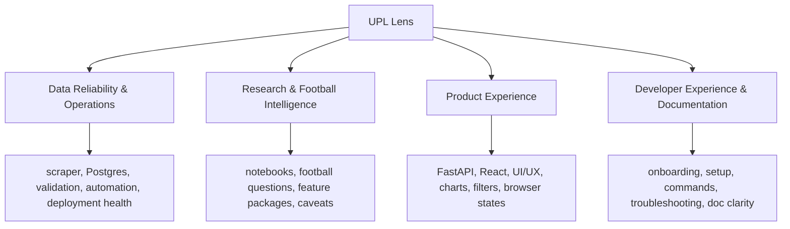

# Start Here

This is the first orientation document for the **UPL Lens** repository. The
project began as a Goal Timing / UPL Match Intelligence research build, then
became a public full-stack football-intelligence product. As of 2026-08-19, the
public software-product phase is frozen and preserved as a completed chapter.

UPL Lens now continues as a maintained Uganda Premier League analytical data
foundation and practical casework system. Backend, data-platform, research, API,
frontend, and operations code still live in this repository, but new UPL work no
longer assumes an automatic notebook-to-API-to-React destination.

The docs are consolidated into seven maintained Markdown files. Do not add a new
doc unless the topic cannot fit cleanly into one of these owners. Active work
belongs in GitHub Issues once it exceeds a small quick fix, needs planning,
affects documentation, or should be resumable by another agent.

## The Project In One Minute

UPL Lens maintains trustworthy UPL source acquisition, Postgres contracts,
validation, reproducible read-only research access, and bounded analytical
cases.

```text
Official UPL website
  -> scraper and source records
  -> maintained Postgres raw/staging/analytics contracts
  -> read-only notebooks and checks
  -> practical analytical cases with findings, outputs, caveats, and endpoints
```

The active foundation is maintained Postgres plus case-specific reproducibility
records. Do not describe the project as a single centrally frozen analytical
snapshot. Each case should carry its own coverage/snapshot record, checks,
notebook evidence, outputs, caveats, and hard endpoint.

React and FastAPI are retained legacy assets from the software-product phase.
They may be used for demonstration, review, retained public surfaces, or a
future explicitly approved presentation path, but they are not mandatory
destinations for new research.

## Current Project Phase

UPL Lens is in strategic transition from public-product hardening to maintained
data foundation plus practical UPL casework.

Current active work should focus on:

1. Maintaining official-source acquisition, Postgres raw/staging/analytics
   contracts, validation, reproducibility, and read-only research access.
2. Defining the practical UPL case workflow in the owning research/casework docs
   and GitHub Issues.
3. Preserving the useful lessons from the completed product phase without
   treating v1 release packaging or frontend polish as the default next step.
4. Keeping deployment disposition, project-board semantics, and architecture
   boundary changes in their own decision-gated Issues.

Status labels used across the transition:

- **Active**: source acquisition, Postgres contracts, validation, operations,
  read-only notebooks, bounded UPL analytical cases, GitHub Issue/branch/draft
  PR discipline, and owner-approved closure.
- **Retained/frozen**: FastAPI, React, Cloudflare/Render deployment knowledge,
  frontend design rules, API contracts, and the completed public-product
  lessons. These remain useful references and code assets.
- **Historical**: the v1 public-release push, old frontend build order, UPL
  Match Intelligence naming, and Goal Timing as the first productized analysis.
- **Separately decision-gated**: public deployment retain/restrict/retire
  decisions, project-board/workflow changes, architecture-boundary rewrites, and
  any future software promotion from a case into API/frontend.

Do not continue v1 release packaging, frontend build-order documentation, public
product polish, or automatic notebook-to-API-to-React promotion unless a current
Issue and owner instruction explicitly reopens that path.
## GitHub-Native Workflow

Use this operating rule:

```text
Docs explain the system.
Issues move the work.
Branches isolate the work.
Pull Requests review the work.
Projects show workflow state.
Milestones define release goals.
Releases record what shipped.
Agents work from Issues when available.
The owner approves closure and release.
```

The default Project pipeline is:

```text
Inbox -> Research -> Ready -> In Progress -> Review / QA -> Done -> Released -> Parked
```

Use `.github/ISSUE_TEMPLATE/` for new work. The initial frontend and
discipline-research seed Issues have been created in GitHub, with reusable
local drafts kept in `.github/ISSUE_DRAFTS/`. Meaningful work should happen on
an Issue-specific branch and enter `main` through a Pull Request after owner
review.

Beginner defaults:

- No file change: no branch is needed.
- Small clear file change: branch and PR; Issue optional.
- Meaningful, risky, unclear, milestone, research, API, data, or frontend work:
  Issue -> branch -> draft PR -> owner test/review -> merge.
- Keep PRs draft until the linked Issue checklist and acceptance criteria are
  complete.
- Test PRs locally or through a preview deployment before merging.
- Delete merged short-lived branches unless the owner intentionally wants to
  preserve an experiment.

## Seven-Doc Structure

| Doc | Owner | Open it when |
|-----|-------|--------------|
| [START_HERE.md](START_HERE.md) | Orientation, doc map, current phase, recent history | You are new, returning, or deciding where work belongs. |
| [PRODUCT_STRATEGY.md](PRODUCT_STRATEGY.md) | Active project identity, retained product-phase lessons, and decision rules | You are checking what UPL Lens is now or whether product-era guidance is active, retained, historical, or decision-gated. |
| [PROJECT_ROADMAP.md](PROJECT_ROADMAP.md) | Planning, GitHub workflow, strengths, gaps, priorities, and historical roadmap context | You need current transition priorities, work-management rules, or a clearly labelled history of the product phase. |
| [FEATURE_PROMOTION_WORKFLOW.md](FEATURE_PROMOTION_WORKFLOW.md) | Research/case workflow, feature history, and exceptional software-promotion rules | You are working in notebooks, starting a bounded UPL case, or checking whether software promotion is explicitly approved. |
| [LOCAL_DEVELOPMENT.md](LOCAL_DEVELOPMENT.md) | Local setup, verification, operations, automation, troubleshooting | You need to run, validate, refresh, deploy, or debug the system. |
| [FRONTEND_DESIGN_SYSTEM.md](FRONTEND_DESIGN_SYSTEM.md) | Retained frontend design, API contract, page requirements, wireframes, seed issue list | You are maintaining retained UI/API assets or working on an explicitly approved frontend/presentation Issue. |
| [diagram_collection.md](diagram_collection.md) | Canonical technical architecture, active/retained classification, and visual reference | You need to distinguish active foundation/casework from retained software, or inspect data-flow, API-flow, database, scraper, or frontend diagrams. |

`visual_inspo.png` remains in `docs/` as a visual asset, not a standalone doc.

## Reading Paths By Task

If you want to run the project locally:

- [LOCAL_DEVELOPMENT.md](LOCAL_DEVELOPMENT.md)
- `.env.example`
- `frontend/.env.example`

If you want to refresh, validate, or troubleshoot data:

- [LOCAL_DEVELOPMENT.md](LOCAL_DEVELOPMENT.md)
- [diagram_collection.md](diagram_collection.md)

If you want to add or promote a football insight:

- [FEATURE_PROMOTION_WORKFLOW.md](FEATURE_PROMOTION_WORKFLOW.md)
- [PRODUCT_STRATEGY.md](PRODUCT_STRATEGY.md)
- the relevant feature folder under `notebooks/features/`

If you want to improve the app:

- [PRODUCT_STRATEGY.md](PRODUCT_STRATEGY.md)
- [FRONTEND_DESIGN_SYSTEM.md](FRONTEND_DESIGN_SYSTEM.md)
- `api/`
- `src/api/`
- `frontend/src/`

If you want current priorities:

- this file
- [PROJECT_ROADMAP.md](PROJECT_ROADMAP.md)
- [PRODUCT_STRATEGY.md](PRODUCT_STRATEGY.md)

## Four Continuous Development Areas



### Data Reliability & Operations

Purpose: keep the source data, database, automation, and deployment
trustworthy.

Read first:

- [LOCAL_DEVELOPMENT.md](LOCAL_DEVELOPMENT.md)
- [PROJECT_ROADMAP.md](PROJECT_ROADMAP.md)
- [diagram_collection.md](diagram_collection.md)

Escalate when the scraper cannot parse source pages, raw counts disagree with
Postgres rows, staging validation finds structural errors, the API would
publish misleading data, routine automation needs admin privileges, or secrets
are exposed.

### Research & Football Intelligence

Purpose: discover useful football questions and promote only validated
insights.

Read first:

- [FEATURE_PROMOTION_WORKFLOW.md](FEATURE_PROMOTION_WORKFLOW.md)
- [PRODUCT_STRATEGY.md](PRODUCT_STRATEGY.md)

Escalate when a dashboard metric cannot be traced to a notebook, SQL query, or
clear product plan.

### Product Experience

Purpose: maintain retained FastAPI/React assets and support explicitly approved presentation work. It is no longer the default destination for every validated analysis.

Read first:

- [PRODUCT_STRATEGY.md](PRODUCT_STRATEGY.md)
- [FRONTEND_DESIGN_SYSTEM.md](FRONTEND_DESIGN_SYSTEM.md)
- `api/routers/`
- `src/api/query_services/`
- `frontend/src/`

Escalate when React needs data that no endpoint exposes cleanly, frontend logic
starts duplicating durable backend logic, a response shape change can break the
dashboard, or the UI hides caveats.

### Developer Experience & Documentation

Purpose: make the project understandable and repeatable for a junior developer,
future contributor, reviewer, or AI agent.

Read first:

- [LOCAL_DEVELOPMENT.md](LOCAL_DEVELOPMENT.md)
- [PROJECT_ROADMAP.md](PROJECT_ROADMAP.md)
- [../AGENTS.md](../AGENTS.md)

Escalate when two docs give conflicting commands, a new developer cannot tell
which doc to read first, a command depends on hidden local setup, or a feature
decision exists in code but not in docs.

## Recent History

### 2026-08-19

- Reoriented UPL Lens from active public-product hardening to a maintained UPL
  analytical data foundation and practical casework system.
- Preserved the completed software-product phase as historical and retained:
  scraper, Postgres, FastAPI, React, hosted operations, documentation ownership,
  GitHub-native execution, validation, and owner-review lessons still matter.
- Replaced central frozen-snapshot wording with maintained Postgres contracts
  plus case-specific reproducibility records.
- Clarified that Goal Timing is the historical first analysis and retained
  product example, while Cards & Discipline and other ideas are case candidates,
  not automatic Feature 2/product-roadmap commitments.

### 2026-07-16

- Reconciled the canonical docs with the merged intelligence-layer frontend:
  API client sync, reusable intelligence primitives, Trends, Teams, Matches,
  Players, Insights, Overview, and About/Methodology are now part of the merged
  release foundation rather than future build-order items.
- Clarified that v1.0 work is now public-release hardening: owner QA,
  operations safety, release documentation, and follow-up research planning.
- Recorded the cache-safety, hosted-observability, and workflow-mode separation
  work as merged release-hardening foundations; remaining release QA stays
  tracked in GitHub.

### 2026-07-15

- Added the cross-route frontend QA checklist so Product Experience PRs have a
  durable route/state/browser verification companion.

### 2026-07-14

- Aligned shared image-backed page heroes and continued public frontend polish
  across the merged product routes.


### 2026-06-10

- Consolidated the docs into seven maintained Markdown files.
- Folded API, frontend launch, page requirement, wireframe, UX request,
  operations, and changelog material into the owning docs.
- Kept [diagram_collection.md](diagram_collection.md) as the visual system and
  architecture reference.
- Added the GitHub-native work-management rule: docs hold durable system
  knowledge, while Issues track active work.

### 2026-06-06

- Added a frontend-facing API contract and linked it from the main docs
  entrypoints.
- Documented the backend intelligence-layer page roles, endpoint mapping, and
  page-by-page upgrade order.
- Added frontend work guidance for API client sync, reusable intelligence
  components, and page upgrades.
- Clarified docs and agent guidance around UPL Lens naming, launch precedence,
  and frontend skills.

### 2026-06-05

- Updated roadmap and diagram public-product language so Product Experience
  planning points at UPL Lens while preserving the former UPL Match Intelligence
  name only as historical context.

### 2026-05-31

- Added the UPL Lens frontend launch package and `visual_inspo.png`.
- Linked the launch material from central docs as a temporary exception to the
  older doc cap. That temporary exception has now been folded into the seven-doc
  structure.

### 2026-05-26

- Consolidated the earlier docs set, merged navigation guidance into
  `START_HERE.md`, and established the small-doc-surface standard.

## Updating Docs Without Re-Creating Sprawl

- Update [START_HERE.md](START_HERE.md) for navigation, current phase, doc
  structure, and recent high-signal history.
- Update [PRODUCT_STRATEGY.md](PRODUCT_STRATEGY.md) only when identity,
  audience, positioning, or product decision rules change.
- Update [PROJECT_ROADMAP.md](PROJECT_ROADMAP.md) for strengths, gaps,
  milestones, and planning shifts.
- Update [FEATURE_PROMOTION_WORKFLOW.md](FEATURE_PROMOTION_WORKFLOW.md) for
  notebook workflow, data-source rules, feature lifecycle, or promotion rules.
- Update [LOCAL_DEVELOPMENT.md](LOCAL_DEVELOPMENT.md) for setup, commands,
  verification, operations, GitHub Actions, hosted troubleshooting, and
  escalation.
- Update [FRONTEND_DESIGN_SYSTEM.md](FRONTEND_DESIGN_SYSTEM.md) for API
  contracts, frontend visual rules, UX requests, page requirements, wireframes,
  and launch decisions.
- Update [diagram_collection.md](diagram_collection.md) when architecture,
  workflows, endpoints, database shape, or known gaps change.

Avoid creating a new doc just because a section is getting detailed. Prefer a
clear section inside an existing source-of-truth file first.
