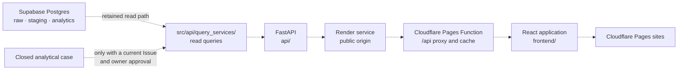
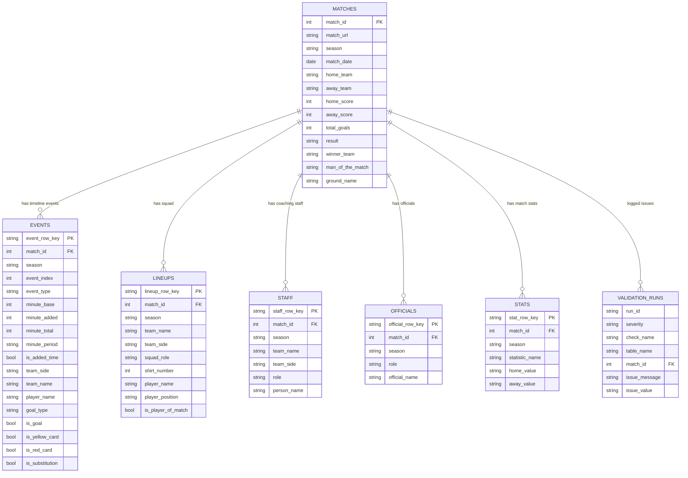
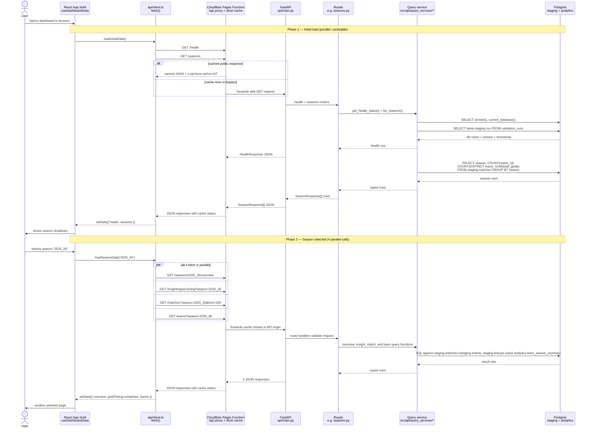
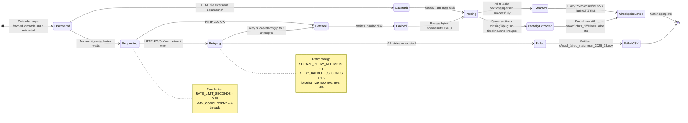

# UPL Lens - Mermaid Diagram Collection

Status: **canonical technical architecture and visual system reference**.

Use this file to determine which parts of UPL Lens are active analytical
infrastructure, which parts are retained from the public-product phase, and how
a practical case reaches trusted data. Detailed case packaging is owned by
[FEATURE_PROMOTION_WORKFLOW.md](FEATURE_PROMOTION_WORKFLOW.md) and Issue #113;
database trust and provenance are coordinated through Issue #112.

The active path is deliberately complete without FastAPI or React:

```text
official UPL source
  -> source checks and scraping
  -> raw.*
  -> cleaning and validation
  -> staging.*
  -> analytics.* only when reuse or semantic value justifies it
  -> read-only notebook and checks
  -> findings/report, caveats, outputs
  -> closed case
```

FastAPI and React remain useful retained assets, but they are an exceptional,
owner-approved presentation path rather than the default end of research.

Keep this file accurate when code changes affect architecture, major workflows,
service boundaries, database tables, or the active/retained classification.

Current planning home: use [START_HERE.md](START_HERE.md) for the four
continuous development areas and concise recent-history context.

---

## Architecture Classification

This classification follows the current code and service dependencies. A
classification describes the default maintenance obligation; it does not
delete code or prevent a separately approved change.

| Classification | Current areas and services | Why |
|---|---|---|
| **Active foundation** | `src/scraping/upl/`, `scripts/data_platform/`, `src/db/`, `src/validation/`, `database/migrations/`, raw/staging/analytics schemas, cache and raw artifacts, regression/contract tests | These acquire, preserve, clean, validate, and model the shared data used by every future case. |
| **Active operations** | `.github/workflows/current-season-update.yml`, `src/operations/`, source-health, routine-refresh, admin-migration, and full-rebuild/backfill modes | Scheduled acquisition and database maintenance run independently of the public app. Issue #84 owns acquisition reliability and season rollover. |
| **Active case access** | `src/research.read_sql`, read-only research credentials, notebooks, case checks, findings/reports, and case outputs | The default analytical consumer is a bounded case using maintained Postgres without write access. Issue #112 owns the detailed trust/provenance contract; Issue #113 owns the concrete case package and lifecycle. |
| **Optional shared analytics** | `analytics.*`, migrations that define reusable derived contracts, and supporting tests | Add a named contract only when logic has stable meaning, is reused across cases, or needs centralized validation/performance. A missing analytics object is not automatically a backlog gap. |
| **Retained/frozen software** | `api/`, `src/api/`, `frontend/`, `render.yaml`, Pages Functions/configuration, `docs/FRONTEND_DESIGN_SYSTEM.md`, and Goal Timing promotion history | These preserve the proven public-product implementation and may receive scoped correctness or maintenance work, but new cases do not flow here automatically. |
| **Separately governed live surfaces** | Cloudflare Pages sites/proxy and the Render FastAPI service | They remain live while Issue #108 evaluates a dormant/archive option. No provider retirement, archive conversion, or static archive is authorized by this architecture issue. |

Database migrations and tests can support both active and retained consumers.
Their classification follows the contract they protect: foundation correctness
is active; endpoint- or UI-only behavior is retained.

## Diagram 1 — Active Foundation And Casework Path

> Solid arrows are the default maintained path. The case ends without requiring
> an endpoint, route, or deployment.

```mermaid
flowchart LR
    SOURCE["Official UPL sources"] --> PREFLIGHT["Source preflight and cache"]
    PREFLIGHT --> SCRAPE["Scraper and refresh plan"]
    SCRAPE --> ARTIFACTS["data/raw/<season>/\nsource artifacts"]
    ARTIFACTS --> LOAD["Validated raw loader\nscoped upserts or explicit rebuild"]
    LOAD --> RAW["raw.*\nsource-shaped records"]
    RAW --> BUILD["Cleaning, reconciliation, validation"]
    BUILD --> STAGING["staging.*\ncleaned source facts"]
    STAGING --> ACCESS["Read-only research access\nsrc.research.read_sql"]
    STAGING --> DECISION{"Stable reusable\nsemantic contract?"}
    DECISION -->|"yes"| ANALYTICS["analytics.*\nshared derived contract"]
    DECISION -->|"no"| ACCESS
    ANALYTICS --> ACCESS
    ACCESS --> CASE["Bounded question\nnotebook and SQL checks"]
    CASE --> EVIDENCE["Findings/report\noutputs and caveats"]
    EVIDENCE --> CLOSED["Case closed"]

    ACTIONS["GitHub Actions\nroutine and explicit admin modes"] --> PREFLIGHT
    ACTIONS --> BUILD
    SUMMARY["Run summaries and validation evidence"]
    PREFLIGHT --> SUMMARY
    BUILD --> SUMMARY
```



The weekly workflow targets acquisition and Postgres maintenance directly. It
does not call FastAPI, React, Cloudflare, or Render, so freezing product work
does not freeze scheduled data maintenance.

### Default Case Access Rules

1. Query `staging.*` for cleaned source facts.
2. Query `raw.*` only to investigate capture or transformation problems.
3. Query an existing `analytics.*` object when it already expresses the needed
   shared metric.
4. Use `src.research.read_sql` and a database role that cannot write.
5. Keep case-specific SQL and checks with the case unless the logic has stable
   meaning beyond that case.
6. Introduce or change `analytics.*` through a migration and regression tests
   only when reuse, semantic consistency, centralized validation, or measured
   performance makes the shared contract worthwhile.
7. Do not create an analytics view merely to enable a future API or dashboard.

## Diagram 2 — Retained Public-Product Path

> This diagram records the live historical implementation. Dashed arrows mean
> retained/optional, not a required next step after case validation. Issue #108
> governs the live public surfaces.



The source, tests, deployment configuration, and product lessons are retained.
This issue does not add routes, endpoints, UI work, provider changes, or a
static archive.

---

## Diagram 3 — Database Entity Relationship (ERD)
> Shows how staging tables relate to each other. All child tables share match_id with staging.matches.



---

## Diagram 4 — Retained API Request Sequence

> Retained implementation reference. This sequence documents how the current
> browser product works; it is not part of the default casework path.
> What actually happens between the browser and the database when you open the dashboard.


---

## Diagram 5 — Active Scraper Package & State
> The internal structure of the scraper and what can happen to each match URL.


